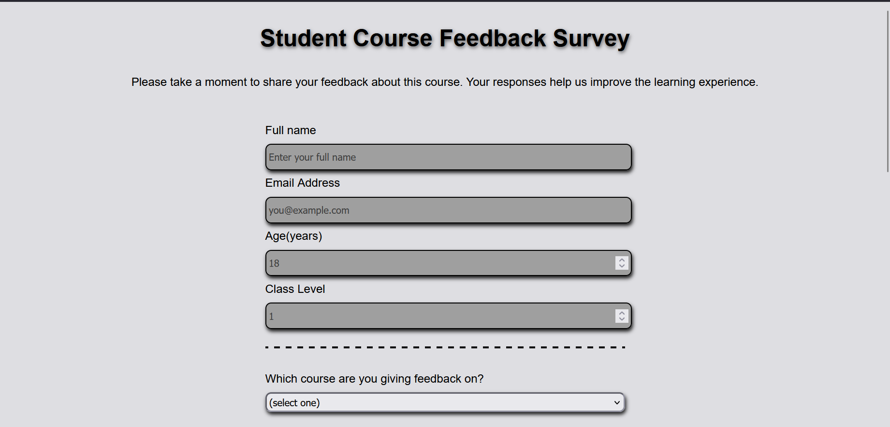
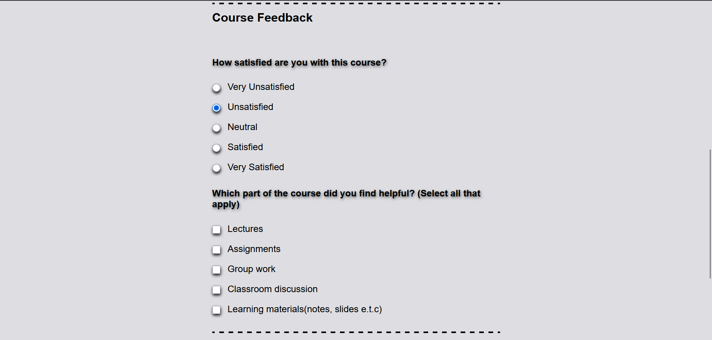

# Student Course Feedback Form

A **responsive student course feedback form** built with **HTML and CSS**.  
This project is part of the **FreeCodeCamp curriculum** and allows students to submit feedback about their courses.

## Table of Contents
- [Overview](#overview)
- [Features](#features)
- [Technologies](#technologies)
- [Usage](#usage)
- [Screenshots](#screenshots)
- [License](#license)

## Overview
This project is a front-end web form where students can provide feedback on courses they have taken.  
It demonstrates form structure, input validation, and responsive design.

## Features
- Text inputs for name, email, and age
- Number inputs with `min` and `max` validation
- Dropdown menu to select course
- Radio buttons for satisfaction level
- Checkboxes to select helpful parts of the course
- Textarea for additional comments
- Submit button, centered and styled
- Responsive layout for desktop and mobile
- Placeholder text guides the user

## Technologies
- HTML5
- CSS3

## Usage
1. Clone the repository:

   ```bash
   git clone https://github.com/nazzyvin/student-feedback-form.git

2. Open index.html in your browser.

3. Fill out the form.
Note: This is a front-end project; form submissions do not send data.

Screenshots




License

This project is open source and free to use for learning purposes.